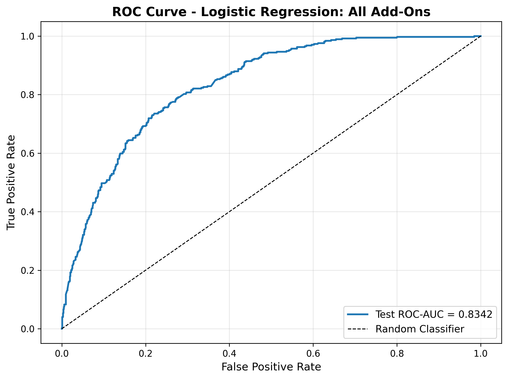
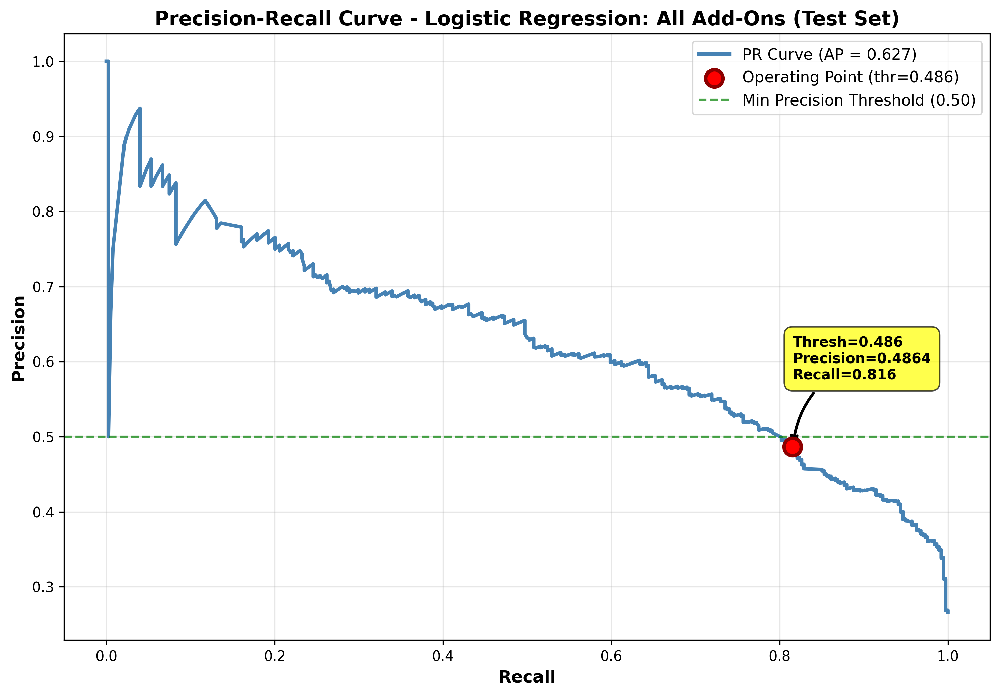
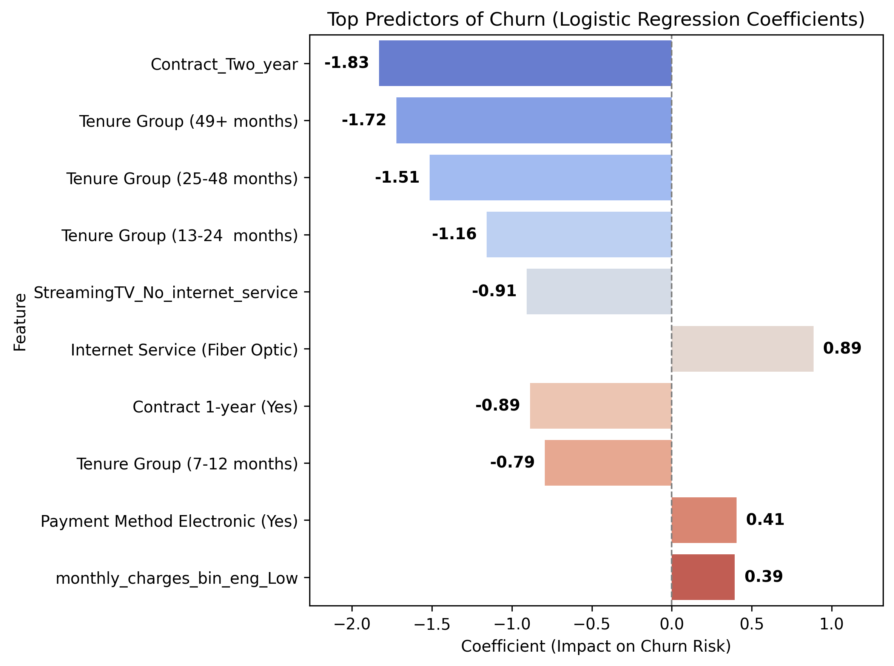

# Final Report — Telco Customer Churn Prediction

## 1. Introduction

### Problem Statement
Customer churn reduces revenue and increases acquisition costs. This project builds a reproducible, interpretable predictive model to identify customers most at risk of churning so that retention efforts can be prioritized where they have the greatest impact.

### Success Criteria
The primary objectives are to identify at least 70% of actual churners (recall ≥ 0.7) while maintaining precision ≥ 0.5. I also track ROC-AUC and AP to assess overall discriminative performance. Threshold selection centers on recall: the operating cutoff was selected on pooled out-of-fold (OOF) validation probabilities to maximize recall while maintaining precision ≥ 0.5 (final threshold ≈ 0.486).

### Stakeholders
The model’s outputs are intended to support decision-making across:
- Executive leadership (strategy and forecasting)
- Customer retention operations (risk-based targeting)
- Marketing (segmentation and outreach design)
- Finance/analytics (ROI evaluation and budgeting)

---

## 2. Data

This analysis uses the **Telco Customer Churn** dataset from Kaggle, which contains **7,043 customer records and 21 original features**. Each record represents a single customer account.

The features can be grouped into four primary domains:

- **Demographics:** gender, `SeniorCitizen`, `Partner`, `Dependents`
- **Account and contract characteristics:** tenure, `Contract`, `PaperlessBilling`, `PaymentMethod`
- **Services:** `PhoneService`, `MultipleLines`, `InternetService`, and related add-on services (`OnlineSecurity`, `OnlineBackup`, `DeviceProtection`, `TechSupport`, `StreamingTV`, `StreamingMovies`)
- **Billing information:** `MonthlyCharges` and `TotalCharges`

The target variable is **Churn**, a binary indicator (Yes/No) identifying customers who discontinued service during the prior month. Numeric features include tenure, `MonthlyCharges`, and `TotalCharges`; all remaining variables are categorical.

The dataset contains no explicit date fields. Account tenure serves as the sole temporal indicator, limiting the analysis to a cross-sectional view rather than a time-series framework. The target variable is moderately imbalanced, with an overall churn rate of **26.6%**, which informed subsequent evaluation metric selection.

Column roles and data types are governed by a predefined manifest (telco_column_role_manifest.csv). Detailed variable definitions are provided in the raw (telco_raw_data_dictionary.csv) and cleaned (telco_wrangling_cleaned_data_dict.csv) data dictionaries for transparency and reproducibility.
---

## 3. Methods

### 3.1 Data Wrangling 

Initial data audits were conducted to assess structure, completeness, and consistency across all variables. This included review of summary statistics, missingness patterns, categorical value domains, and duplicate records.

No constant columns or duplicate rows were identified.

Data types were standardized by converting `TotalCharges` to numeric (coercing invalid values to NaN) and casting all categorical variables to categorical data types. The `SeniorCitizen` indicator was mapped from binary values (0/1) to human-readable labels (Yes/No).

Rows with missing `TotalCharges` values (n = 11) were removed. These observations corresponded to new customers with tenure equal to zero and did not provide meaningful information for churn modeling.

Outlier and consistency checks were performed using interquartile range (IQR) methods for numeric variables, along with validation against business rules (e.g., customers without internet service should not have internet add-ons). No outliers, impossible values, rare categorical levels, or business-rule contradictions were detected, and no category consolidation was required.

To support downstream analysis and modeling, several engineered features were created:

- `tenure_group_eng`: tenure binned into 0–6, 7–12, 13–24, 25–48, and 49+ months

- `total_services_eng`: count of subscribed services

- `monthly_charges_bin_eng`: MonthlyCharges binned into Low, Medium, and High

- `is_month_to_month_eng`: indicator for month-to-month contracts

- `short_tenure_month_to_month_eng`: flag for customers with short tenure on month-to-month contracts

- `has_streaming_eng`: indicator for any streaming service subscription

Exploratory visualizations (histograms and boxplots) were used to verify distributions and confirm the effects of transformations and feature engineering.

All steps were executed with fixed random seeds (SEED = 42) to ensure reproducibility.

The final analytical dataset contains **7,032 customer records and 27 features**, including all 21 original variables and 6 engineered features. The cleaned dataset and accompanying data dictionary were saved for reproducibility and future use.

The cleaned dataset and accompanying data dictionary were saved to support reproducibility and downstream analysis (`telco_wrangling_cleaned.csv` and `telco_wrangling_cleaned_data_dict.csv`).

### 3.2 Exploratory Data Analysis
#### Target Variable

The churn rate is **26.6%**, indicating moderate class imbalance. This informed subsequent metric selection and threshold design.

---

#### Univariate Patterns

Key distributions include:

- **Tenure:** Right-skewed, with many customers in early tenure stages.
- **MonthlyCharges:** Moderately right-skewed.
- **TotalCharges:** Strongly right-skewed, reflecting cumulative billing.
- **Contract type:** Month-to-month contracts are most common, while long-term contracts concentrate among customers with 49+ months of tenure.

These patterns suggest meaningful behavioral segmentation by contract length and tenure.

---

#### Bivariate Relationships with Churn

Effect size analysis identified:

- **Strongest numeric predictor:** `tenure` (Cohen’s d = -0.857), indicating substantially lower churn among long-tenure customers.
- **Strongest categorical predictor:** `Contract` (Cramér’s V = 0.410), reflecting materially different churn rates across contract types.

Among numeric variables, tenure was the only predictor demonstrating a large effect size. Most categorical variables showed weak to moderate associations.

Several predictors exhibited negligible association with churn (`gender`, `PhoneService`, `MultipleLines`, `has_streaming_eng`) and were evaluated for potential exclusion during feature simplification.

---

#### Multivariate Relationships & Collinearity

Several strong correlations were observed:

- **Tenure–TotalCharges:** r ≈ 0.83  
- **MonthlyCharges–total_services_eng:** r ≈ 0.80  
- **InternetService–MonthlyCharges:** η ≈ 0.906  

These relationships indicate substantial redundancy among billing and service features.

An interaction between short tenure and month-to-month contracts revealed a particularly high-risk segment: customers with short tenure on month-to-month contracts exhibit a churn rate of **51%**, nearly twice the overall churn rate (26.6%).

No evidence of target leakage or proxy variables was identified.

---

#### Feature Simplification Strategy

Based on collinearity analysis and effect size screening, redundant billing variables, negligible predictors, and highly correlated composite indicators were removed in alternative feature specifications.

Created three alternative ('pruned') feature sets from the remaining variables with the following variations to reduce redundancy and collinearity:

- "Monthly Charges": Included binned monthly charges  (`monthly_charges_binned`) and representative add-on service (`Online Security`). Excluded `InternetService` and all other add-ons because `InternetService` was highly correlated with 'monthly_charges_binned' and the internet add-ons are all highly correlated with `InternetService` and each other.
- "Internet Service": Included `InternetService` and excluded monthly charges and all add-ons, to address collinearity issues described above.
- "All Add-Ons": Included monthly charges plus all add-ons and excluded `InternetService`. The goal was to minimize some collinearity while trying to capture any add-ons of particular value.

Cross-validated model comparisons were used to ensure simplification did not degrade performance relative to project targets (recall ≥ 0.70, precision ≥ 0.50, ROC-AUC > 0.75).

---

#### Modeling Implications

Given the predominance of low-cardinality categorical predictors, logistic regression provides a strong, interpretable baseline. Gradient-boosted tree-based models (i.e., LightGBM) were evaluated to capture potential nonlinearities and interaction effects.

Cross-validation was used to assess stability and confirm that feature pruning maintained performance at the defined operating threshold.

When performance differences were negligible under cross-validation, the simpler model was preferred to improve interpretability and reduce the risk of multicollinearity.

---

### 3.3 Modeling Approach

Model development followed a structured progression:

1. **Baseline benchmark** using a stratified baseline classifier to establish a minimum performance reference.
2. **Logistic regression** to provide interpretability and establish a transparent, explainable baseline.
3. **Advanced models** (i.e., tree-based gradient boosting with LightGBM) to improve predictive performance.

Class imbalance was addressed using model-based class weighting rather than resampling.

Evaluation was conducted using both threshold-independent metrics (**ROC-AUC**, **Average Precision**) and business-aligned operating criteria (recall maximized subject to a precision constraint). Operating thresholds were selected using cross-validated OOF predictions to reduce optimistic bias. Model selection was based on cross-validation performance, with final validation performed on a held-out test set.

All analysis was conducted in modular, reproducible Jupyter notebooks using only features defined in the project column manifest. Outputs, tables, and figures were saved to support transparency and reproducibility. 

Note: **Average Precision (AP)** is a threshold-free precision–recall metric (scikit-learn average_precision_score). It is the area under the precision-recall curve. For a stratified baseline, AP equals the positive-class prevalence (≈0.266); higher AP indicates better ranking. 

---
#### Feature Set Evaluation

To assess the impact of redundancy and multicollinearity on model performance and interpretability, four feature configurations were evaluated.  

1. **All Features:** Full set of engineered and original predictors.
2. **Monthly Charges:** Includes binned monthly charges and retains a representative add-on (`OnlineSecurity`).
3. **Internet-Service Simplified Set:** Retains InternetService while removing correlated monthly charges and add-on features.
4. **Add-On Services:** Keeps monthly charges and all add-on services and drops correlated InternetService.

These configurations were designed to test whether simpler, more interpretable representations could maintain predictive performance relative to the full feature set.

Each feature set was evaluated using Logistic Regression and LightGBM models under identical cross-validation procedures. The stratified dummy baseline was evaluated only on the full feature set.

In total, nine models were trained and compared.

---

## 4. Results

All reported performance metrics are based on pooled out-of-fold validation unless otherwise noted.

### 4.1 Baseline Performance

**Stratified Baseline Classifier**

As shown in Table 1, the stratified baseline classifier performed at chance level. Recall, precision, and AP closely match the overall churn rate (26.6%), and ROC-AUC (0.5074) indicates no meaningful discrimination between churners and non-churners.

**Table 1. Stratified baseline classifier metrics**

| Metric | Value |
|---|---|
| Recall | 0.2781 |
| Precision | 0.2766 |
| ROC-AUC | 0.5074 |
| AP | 0.2688 |

This establishes a meaningful lower bound for model performance.

---

### 4.2 Model Comparison at Standard Threshold (0.50)

Using pooled out-of-fold (OOF) probabilities and a standard 0.50 threshold (Table 2), both Logistic Regression and LightGBM substantially outperformed the baseline.

Across models:

- **Recall:** Mean 0.809 (range: 0.797–0.827)
- **Precision:** ≈ 0.51 (range: 0.498–0.525)
- **ROC-AUC:** Mean 0.842 (range: 0.833–0.849)
- **AP:** Mean 0.639 (range: 0.615–0.663)

LightGBM achieved slightly higher recall at the 0.50 threshold, while Logistic Regression achieved slightly higher precision in several configurations. Overall discrimination (ROC-AUC) was strong and consistent across models.

**Table 2. Model comparison using pooled OOF metrics (threshold = 0.50)**

| Model | Recall | Precision | ROC-AUC | AP | Threshold |
|---|---:|---:|---:|---:|---:|
| LightGBM: All Features | 0.8268 | 0.5076 | 0.8467 | 0.6572 | 0.5 |
| LightGBM: Internet Service | 0.8174 | 0.5000 | 0.8332 | 0.6150 | 0.5 |
| LightGBM: Monthly Charges | 0.8134 | 0.4980 | 0.8356 | 0.6237 | 0.5 |
| LightGBM: All Add-Ons | 0.8100 | 0.4988 | 0.8363 | 0.6302 | 0.5 |
| Logistic Regression: All Add-Ons | 0.8033 | 0.5254 | 0.8463 | 0.6500 | 0.5 |
| Logistic Regression: All Features | 0.8020 | 0.5250 | 0.8487 | 0.6627 | 0.5 |
| Logistic Regression: Internet Service | 0.8020 | 0.5159 | 0.8417 | 0.6349 | 0.5 |
| Logistic Regression: Monthly Charges | 0.7973 | 0.5203 | 0.8432 | 0.6390 | 0.5 |

At this standard cutoff, all models met or exceeded the project’s minimum recall target (≥ 0.70) while maintaining approximately 0.50 precision.

---

### 4.3 Performance Under Precision Constraint

To align with the defined operating objective (recall maximized subject to precision ≥ 0.50), thresholds were selected using pooled OOF predictions with a small safety buffer (precision ≥ 0.52 during selection).

Under this constraint (Table 3):

- Logistic Regression models achieved the highest recall while maintaining the precision requirement.

- **The Logistic Regression: All Add-Ons** configuration achieved the strongest balance (Recall = 0.817, Precision = 0.520).

- LightGBM models required higher thresholds to satisfy the precision constraint, resulting in modest recall reductions relative to their 0.50 performance.

**Table 3. Model comparison using pooled OOF metrics with precision constraint**

| Model | Meets constraint? | Chosen threshold | Recall | Precision | ROC-AUC | AP |
|---|---|---:|---:|---:|---:|---:|
| Logistic Regression: All Add-Ons | True | 0.4856 | 0.8167 | 0.5200 | 0.8463 | 0.6500 |
| Logistic Regression: All Features | True | 0.4916 | 0.8107 | 0.5202 | 0.8487 | 0.6627 |
| LightGBM: All Features | True | 0.5295 | 0.8060 | 0.5201 | 0.8467 | 0.6572 |
| Logistic Regression: Monthly Charges | True | 0.4948 | 0.8020 | 0.5202 | 0.8432 | 0.6390 |
| Logistic Regression: Internet Service | True | 0.5063 | 0.7987 | 0.5200 | 0.8417 | 0.6349 |
| LightGBM: All Add-Ons | True | 0.5327 | 0.7880 | 0.5201 | 0.8363 | 0.6302 |
| LightGBM: Monthly Charges | True | 0.5385 | 0.7813 | 0.5200 | 0.8356 | 0.6237 |
| LightGBM: Internet Service | True | 0.5428 | 0.7813 | 0.5200 | 0.8332 | 0.6150 |

These results indicate that, once the operating precision requirement is enforced, Logistic Regression performs competitively — and in some configurations, slightly better — than LightGBM.

---

### 4.4 Model Selection

**Logistic Regression: All Add-Ons** with 0.4856 probability threshold was chosen as the final model because it aligns most directly with the project’s operational objective: maximize recall while maintaining precision at or above an acceptable minimum.

Under the precision constraint (minimum precision ≈ 0.50, implemented as 0.52 to provide a small safety buffer), Logistic Regression: All Add-Ons meets the constraint and delivers the highest out-of-fold recall (0.8167).

The model’s threshold-free ranking performance is also strong (ROC-AUC = 0.8463; AP = 0.6500), indicating it distinguishes churners from non-churners effectively even before selecting a decision threshold.

Competing models, including the LightGBM variants, achieve similar ROC-AUC and AP, but none outperform Logistic Regression: All Add-Ons on the primary criterion: recall. Because the business requirement prioritizes identifying as many likely churners as possible without an unacceptable increase in false positives, constrained recall is the decisive metric.

As a secondary advantage, logistic regression is simpler and more interpretable, making it easier to communicate to stakeholders and to translate results into action. The fitted coefficients (e.g., odds ratios) help identify the strongest churn predictors, supporting targeted retention strategies and improving trust and adoption.

Overall, Logistic Regression: All Add-Ons meets the precision requirement and provides the best churn capture under the chosen operating constraint, making it the most appropriate final model for this use case.

In practice, the optimal model choice may depend on additional business factors, such as the relative costs of customer churn versus retention offers, which are not specified here.

### 4.5 Final Model Test Performance
*(Logistic Regression — All Add-Ons Feature Set)*

The final Logistic Regression model was retrained on the full training dataset using the optimal hyperparameters identified during cross-validation (C = 10, penalty = L1, solver = liblinear, class_weight = balanced, max_iter = 1000, random_state = 42).

Predicted probabilities were then generated on the held-out test set, and the pre-selected operating threshold (0.4856), determined from pooled out-of-fold validation, was applied to obtain final classifications.

Test performance closely mirrors pooled out-of-fold (OOF) validation estimates, indicating minimal overfitting. Recall remains stable (0.817 OOF vs. 0.816 test), and ROC-AUC declines only modestly (0.846 → 0.834), suggesting good generalization to unseen data  (Table 4).

**Table 4. Final Model Performance (OOF vs Test)**
| Metric         | Train (OOF) | Test   |
| -------------- | ----------- | ------ |
| Recall         | 0.8167      | 0.8155 |
| Precision      | 0.5200      | 0.4864 |
| ROC-AUC        | 0.8463      | 0.8342 |
| AP             | 0.6500      | 0.6273 |

Precision on the test set (0.4864) is slightly below the 0.50 target. This modest decline reflects normal sampling variability and the sensitivity of precision to threshold calibration. Importantly, recall remains stable, preserving the primary objective of high churn capture.

---

**Discrimination Performance**

Figure 1 shows the ROC curve for the final model on the test set.

**Figure 1 — ROC Curve (Final Model, Test Set)**

The curve remains well above the diagonal chance line, consistent with the test ROC-AUC of 0.834. This indicates that the model effectively ranks customers by churn risk across classification thresholds.

Because the business objective prioritizes recall while maintaining acceptable precision, the Precision–Recall curve provides a more operational view of performance.

**Figure 2 — Precision–Recall Curve (Final Model, Test Set)**

The selected operating threshold (0.486) is highlighted on the curve. This point reflects the trade-off between churn capture and false positives and aligns with the defined precision constraint.

---

**Confusion Matrix (Test Set, threshold = 0.4856)**

Tables 5 and 6 summarize classification outcomes on the test set.

- 305 of 374 churners (81.6%) were correctly identified.
- 69 churners (18.5%) were missed.
- 322 retained customers (31.2%) were incorrectly flagged for outreach.

This means the model correctly identifies approximately four out of five churners, while roughly one-third of retained customers would receive unnecessary retention contact. This trade-off is consistent with the project objective.

**Table 5. Confusion Matrix (Counts)**
|            | Predicted No | Predicted Yes |
| ---------- | ------------ | ------------- |
| Actual No  | 711          | 322           |
| Actual Yes | 69           | 305           |

**Table 6. Row-Normalized Confusion Matrix (%)** *
|            | Predicted No | Predicted Yes |
| ---------- | ------------ | ------------- |
| Actual No  | 68.83%       | 31.17%        |
| Actual Yes | 18.45%       | 81.55%        |

* *Percentages are normalized by true class.*

Overall, the final Logistic Regression model demonstrates stable generalization and meets the primary objective of high churn recall with controlled precision. Performance consistency between validation and test sets supports its suitability for deployment, subject to ongoing monitoring and periodic recalibration.

---

### 4.6 Final Model Predictors of Churn

Logistic regression coefficients represent changes in log-odds of churn relative to each feature’s reference category (using one-hot encoding with `drop='first'`). For interpretability, coefficients are converted to odds ratios (exp(β)) and percent change in odds. These effects describe statistical associations and should not be interpreted causally.

- Odds ratio **< 1** → lower churn odds (retention-associated)
- Odds ratio **> 1** → higher churn odds (churn-associated)

Table 7 lists the ten predictors with the largest absolute coefficients.
 
**Table 7. Top 10 Predictors of Churn**

*Predictors ranked by largest absolute coefficient magnitude.*

| Feature                           |   Coefficient |   Odds Ratio |   % Change in Churn Odds |
|:----------------------------------|--------------:|-------------:|-------------------------:|
| Contract (2-year)                 |         -1.83 |         0.16 |                   -83.98 |
| Tenure Group (49+ months)         |         -1.72 |         0.18 |                   -82.14 |
| Tenure Group (25-48 months)       |         -1.51 |         0.22 |                   -77.99 |
| Tenure Group (13-24 months)       |         -1.16 |         0.31 |                   -68.57 |
| Streaming TV (No internet)        |         -0.91 |         0.4  |                   -59.62 |
| Internet Service (Fiber Optic)    |          0.89 |         2.43 |                   142.82 |
| Contract (1-year)                 |         -0.89 |         0.41 |                   -58.74 |
| Tenure Group (7-12 months)        |         -0.79 |         0.45 |                   -54.83 |
| Payment Method (Electronic-Check) |          0.41 |         1.5  |                    50.03 |
| Monthly Charges Low (≤ $35)       |          0.39 |         1.48 |                    48.37 |

---

**Visualizing Predictor Strength**

Figure 3 displays the same predictors on the log-odds scale to compare relative magnitude and direction.

**Figure 3. Top Predictors Ranked by Coefficient Magnitude (Log-Odds Scale)**

Negative values indicate retention-associated factors (reduced churn likelihood), while positive bars indicate elevated churn risk.

Across the strongest predictors, most large-magnitude effects are negative, indicating that customer stability factors (contract length and tenure) are the strongest predictors in the model, while elevated churn risk is concentrated in specific higher-risk segments.

#### Retention-Associated Factors

**Contract Length**

Customers on **1-year** and especially **2-year contracts** exhibit substantially lower churn odds relative to the reference category (month-to-month).

- Two-year contracts reduce churn odds by approximately **84%**.
- One-year contracts reduce churn odds by approximately **59%**.

Longer contractual commitments likely reflect both switching barriers and greater customer stability.

**Tenure**

All non-reference tenure bins (7–12, 13–24, 25–48, 49+ months) are associated with lower churn odds relative to new customers (0–6 months).

- Customers with 49+ months tenure have approximately **82% lower churn odds**.
- Even moderate tenure (13–24 months) reduces churn odds by nearly **69%**.

This pattern reflects a common lifecycle pattern: churn risk is highest early in the customer relationship.

**No Internet Service Segment**

The variable "Streaming TV (No internet service)" appears among the strongest negative coefficients. This does not indicate a protective effect of streaming behavior. Rather, it functions as an indicator for customers without internet service.

Because “No internet service” is encoded across all internet-dependent add-ons, this coefficient effectively captures customers whose InternetService = No relative to those with internet access in the baseline add-on category.

#### Churn-Associated Factors

**Internet Service = Fiber Optic**

Compared to DSL (reference), fiber optic customers have 143% higher churn odds. This may reflect competitive fiber markets, pricing sensitivity, or higher service expectations.

**Payment Method = Electronic Check**

Relative to automatic bank transfer (reference), electronic check users exhibit **50% higher churn odds**. This may reflect differences in customer segment characteristics or lower autopay adoption, potentially indicating weaker commitment or billing friction.

**Monthly Charges = Low (≤ $35)**

Relative to high monthly charges (> $70), low monthly charges are associated with **48% higher churn odds**. This may indicate lower engagement or greater price sensitivity.

#### Summary

Overall, the model identifies two broad patterns:

1. **Customer stability variables** (contract length, tenure) strongly reduce churn risk.
2. **Specific customer subgroups** (fiber internet, electronic payment, low engagement tiers) elevate churn risk.

These predictors are most valuable for segmentation and targeted retention strategy design (e.g., proactive outreach to fiber + electronic check customers). While not causal, they provide actionable insight into which customer groups warrant prioritization.
---

## 5. Limitations

Several limitations should be considered when interpreting these results:

**Threshold Trade-Off:** Optimizing for high recall at a relatively low operating threshold increases false positives, reducing precision. If deployed, this would increase outreach volume and associated costs.

**Class Imbalance Strategy:** Class imbalance was addressed using model-based class weights rather than sampling or cost-sensitive optimization. Alternative approaches (e.g., SMOTE, calibrated cost functions, or profit-based optimization) were not explored.

**Cross-Sectional Design:** The dataset does not contain explicit temporal features beyond tenure, limiting analysis to a cross-sectional view rather than true time-to-event modeling.

**Single Dataset:** Results are based on a single public dataset and may not generalize to other industries, pricing structures, or competitive environments.

**Predictive Model:** Coefficients reflect statistical associations rather than causal relationships. Interventions based on these findings should be validated through controlled experimentation (e.g., A/B testing).

---

## 6. Discussion

The final model was optimized to maximize recall subject to a minimum precision requirement. As expected, prioritizing recall increases the false positive rate, meaning retention teams would engage a larger pool of customers — including some who would not have churned.

Operationally, this creates a classic cost–benefit trade-off. Higher recall increases the likelihood of preventing churn but raises intervention costs. Organizations should evaluate:

- Per-contact outreach cost
- Expected retention uplift
- Customer lifetime value

These inputs can inform recalibration of the operating threshold to align model deployment with business objectives.

Importantly, model performance remained stable between cross-validation and test sets, indicating reliable generalization. However, if deployed in production, periodic monitoring and recalibration would be necessary to address potential drift in customer behavior or market conditions.

## 7. Recommendations

The model identifies several actionable opportunities for targeted retention strategies:

- **Move Customers to Longer Contracts:** Longer contract terms are strongly associated with lower churn. Offer structured incentives or loyalty discounts to encourage customers to switch to longer-term agreements.

- **Prioritize Fiber Optic Customers:** Fiber optic customers exhibit substantially higher churn odds. Audit service quality, address reliability issues, and clearly communicate improvements. Consider loyalty incentives for high-bandwidth users.

- **Promote Automatic Payments::** Customers paying via electronic check have elevated churn risk. Encourage enrollment in autopay through discounts or convenience incentives, and ensure billing processes are frictionless and reliable.

- **Use Low-Cost Outreach for Lower-Billing Customers:** Customers in the lowest billing tier exhibit higher churn odds, which may reflect greater price sensitivity or lower perceived value. This segment probably generates lower revenue per user so retention efforts should be scaled accordingly. Use low-cost digital outreach (e.g., email or in-app messaging) and test value-focused bundles or incremental add-ons that increase perceived benefit without substantially raising monthly cost.

- **Monitor Stable No-Internet Customers:** Customers without internet service have substantially lower churn odds. This segment may require less intensive retention efforts compared to higher-risk groups, but should still be monitored to ensure stability over time.

By focusing retention efforts on these identifiable high-risk segments, the organization can allocate resources more efficiently and improve overall customer lifetime value.

---
